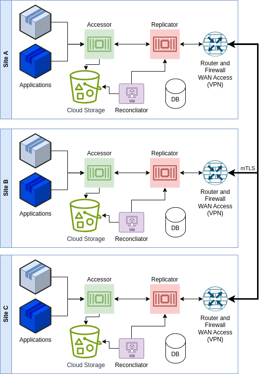
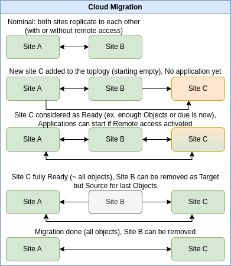

# Clone Cloud Store

This project uses Quarkus, the Supersonic Subatomic Java Framework, based on Java 21.

If you want to learn more about Quarkus, please visit its website: https://quarkus.io/ .

**Clone Cloud Store** (*CCS*) allows to simplify access to Cloud Storage for major services such as
Amazon S3 or S3 like implementations, Azure Blob Storage and Google Cloud Storage.

It provides a simple REST API, much more simpler than usual ones, for Quarkus environments.

One of the goal is to simplify handling big InputStream files, without having to store them physically on disk 
or in memory, neither in client application neither in front CCS services. 

To allow this, specific functionalities of Quarkus Rest services (client and server) are used, such as the possibility
to send or receive such InputStream, chunk by chunk, and with back pressure control.

  *It might be possible to use other Http Client, but one has to take care of possible limitations of such Http SDK, 
  such as to not send or receive from client side with all InputStream in memory.*

Clone Cloud Store allows also to clone storage between various Cloud sites, even using different
technologies (for instance, one using Amazon S3, another one using Azure Blob Storage):

- It can be used in 1 site only, or multiples sites (no limitations). When a bucket or object is created/deleted on 
  one site, it is automatically asynchronously replicated to other sites. If an object is missing, due to outage or
  local issues, it can try to reach a copy synchronously on one of the remote sites and proceeds if it exists 
  to its local restoration asynchronously.  

  

- It provides a Reconciliation algorithm which will compare all sites to restore existing Bucket and Objects 
  everywhere. This process is not blocking, meaning the sites can continue to run as usual.

- This reconciliation process allows Disaster Recovery process, without interruption of service during recovery. Note 
  that new creation/deletion of Buckets or Objects is taken into account during reconciliation. 

  

- This reconciliation process allows Cloud migration, without interruption of service during cloning. Note
  that new creation/deletion of Buckets or Objects is taken into account during reconciliation. 

  

Cloud Clone Store relies on Quarkus and other technologies:

- A database to store the status of Buckets and Objects: MongoDB or PostgreSql
- A topic/queue system to allow asynchronous actions: Kafka or Pulsar
- Optional Prometheus to get observability metrics
- At least 5 JVM processes: (more JVM can be setup to improve reliability and performance) 
  - Accessor (1 or more)
  - Accessor for Replicator (1 or more)
  - Replicator (1 or more)
  - Reconciliator (1)
  - Administration (1)

A simplest implementation with 1 JVM (1 or more) is available without database, topic or remote sites support. 
It allows to test the solution with your application or to allow a smooth move to Cloud Clone Store: 
**Accessor Simple Gateway**

See [available documentation here](https://fredericBregier.github.io/clone-cloud-store/index.html).

## Available functionalities

- Database: MongoDB
- Topics: Kafka

- Common
  - Full support for InputStream within Quarkus (through a patch of Quarkus)
  - Full support of Database choice between MongoDB and PostgreSql (by configuration)
- Accessor
  - Fully functional
  - Include remote checking if locally not present (by configuration)
  - Include remote cloning
  - Include Public Client and Internal Client (Quarkus)
  - Include Public Client based on Apache httpclient 5 without need of Quarkus
  - Simple Gateway with no Database nor Remote access or cloning available
- Driver
  - Support of S3, Azure Blob Storage and Google Cloud Storage
- Replicator
  - Fully functional for replication or preemptive remote action
- Topology
  - Full support for remote Clone Cloud Store sites
- Quarkus patch client: patch until Quarkus validate PR 37308
- Reconciliator
  - Logic in place but not yet functional (so no Disaster Recovery or Cloud Migration yet)
  - Will need extra API on Replicator

## Missing or In Progress Functionalities

- API could change, in particular Accessor public API (for client application) (see Client Authentication)

- Client authentication

  - Could be done through MTLS or OIDC
  - For CCS interservice authentication, MTLS is the choice but not yet implemented
  - Note that API, in particular public API of Accessor Service, could change due to choice of Authentication;
    For instance, currently, the clientId is passed as a header but later on could be deduced from authentication

- Reconciliation

  - First steps on Reconciliation computations are still in progress
  - Note that replication is active and remote access if not locally present is possible (through configuration)

- PostgreSQL full support

  - Currently, only MongoDB is fully supported.
  - PostgreSQL shall be available soon.
  - Missing Liquibase configuration for both PostgreSql and MongoDB

- Kafka is the default Topic manager. However, switching to Apache Pulsar should be easy by just applying
  changes to pom.xml (moving from Kafka to Pulsar) and to application.yaml to ensure correct configuration is done.

- Advanced functionalities such as:

  - Allowing specific access on all or part of CRUD options to a Bucket owned by an application to another one
    (for instance, to allow producer / consumer of files)
  - Compression of HTTPS link is functional but not yet activated (and will be based on a property)
  - Bandwidth limitation is moved to Quarkus normal configuration (see https://quarkus.io/guides/http-reference#configure-traffic-shaping)

    - It shall be useful only for Replicator and in particular in outbound global mode per site

  - Quarkus Metrics are available but not yet for actions within Clone Cloud Store. The work is on going.
  - Health check service to be done

- Distribution according to various options is still in debate

  - A choice between Kafka or Pulsar implies 2 different jar due to pom differences
  - However, for PostgreSql or MongoDB, it can be done through configuration so keeping one jar
  - Should it be separate jar (individual per module and per option) or flatten jar (per option)?
  - Helm, Ansible and Dockerfile or other ways to distribute image 

## Notes of versions

# 0.8.0 2024/02
- Add Apache http client for Accessor Public client (no Quarkus dependency)
- 

# 0.7.0 2024/01
- Support of MongoDB and Kafka
- Support of Accessor with remote access and proactive reconciliation
- Support of Simple Gateway Accessor
- Support of Replicator
- Support of Topology
- Support of Azure Blob Storage, Google Cloud Storage, in addition of Amazon S3 and S3 like
- First steps on Reconciliator batch

# 0.6.0 2023/11
- Patch of Quarkus to support InputStream on client side (upload and download)

# 0.5.0 2023/10
- Refactorization and simplification
- Support of Dynamic choice of Database (MongoDB or PostgreSql) in Common

# 0.4.0 2023/09
- Performance improvements
- Support of proactive replication from Accessor

# 0.3.0 2023/07
- Adding Topology support to Replicator

# 0.2.0 2023/01
- Replicator support with asynchronous replication
- Internal Accessor support

# 0.1.0 2022/06
- Public Accessor support
- Driver for Amazon S3 and S3 like support
