BPMN for Accessor
####################################

Bucket
**********

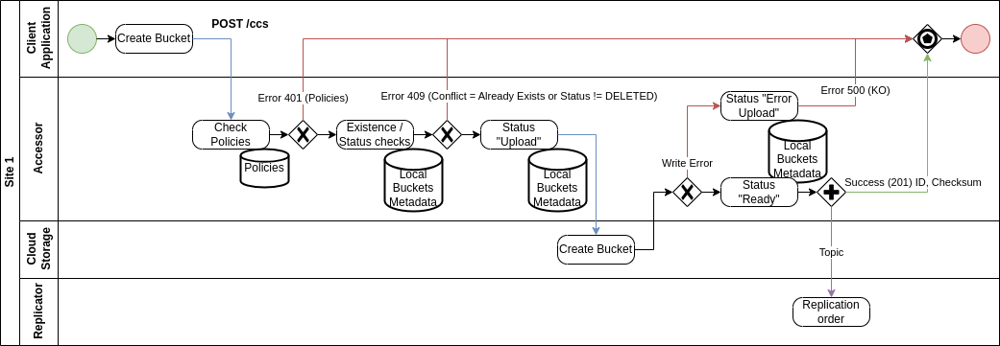

  Create Bucket

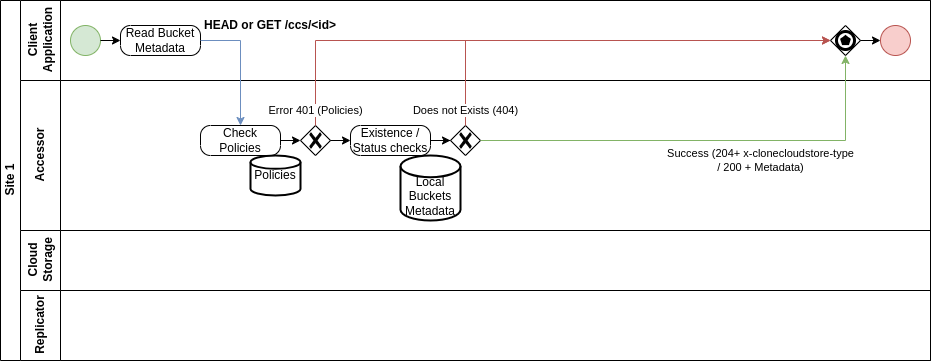

  Check Local Existence Bucket (GET for Metadata)

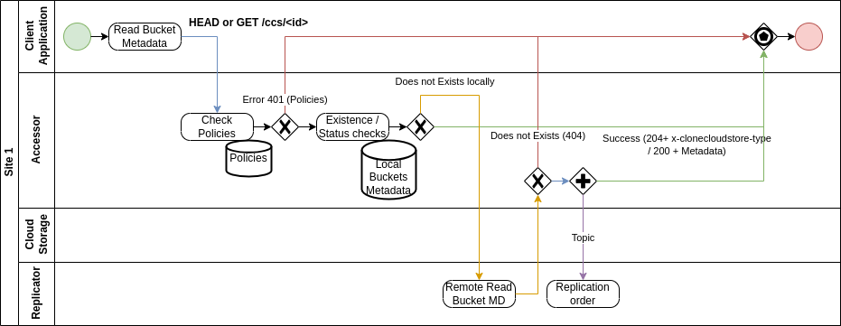

  Check Local/Remote Existence Bucket (GET for Metadata)

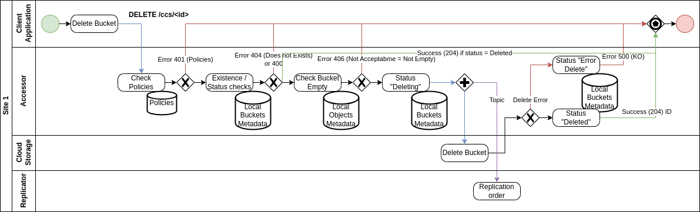

  Delete Bucket

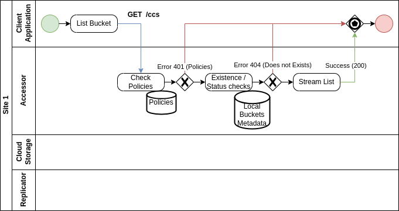

  List Buckets

Object
**********

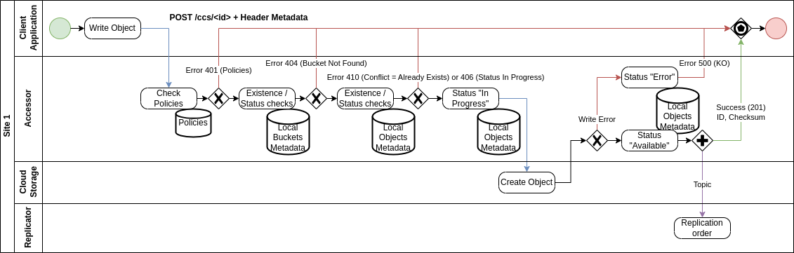

  Create Object

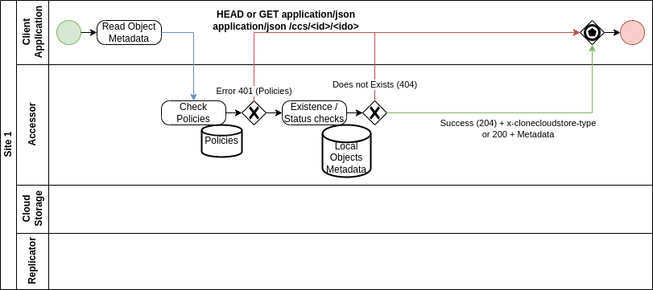

  Check Local Existence Object or GET Metadata

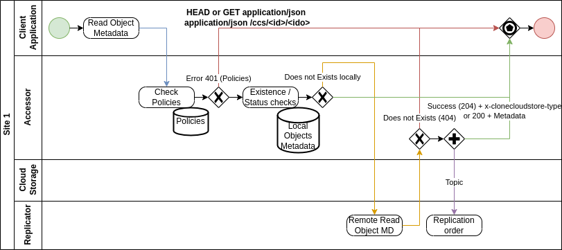

  Check Local/Remote Existence Object or GET Metadata

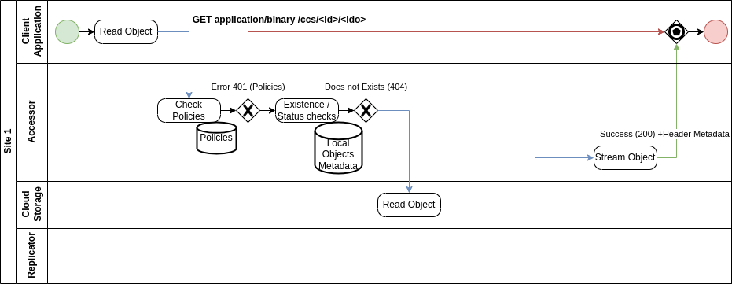

  Get Local Object's Content

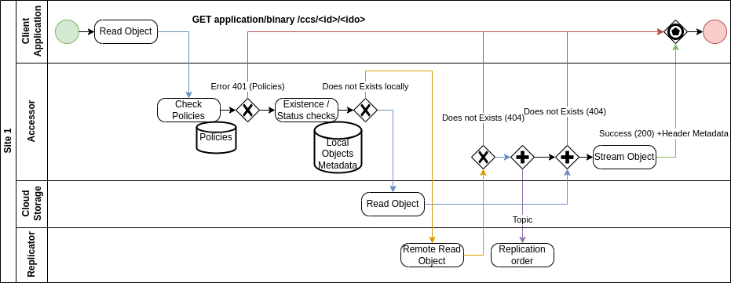

  Get Local/Remote Object's Content

.. figure:: ../images/clone-cloud-store-diagram-Accessor-Delete.drawio.png
  :alt: Delete Object

  Delete Object

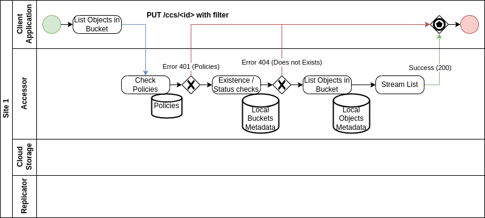

  List Objects in Bucket

Bucket Internal
*****************
Specific implementations for Internal Accessor:

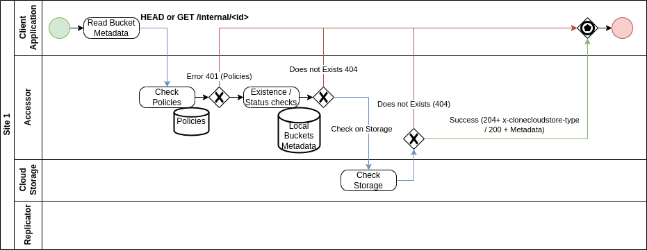

  Check Existence and Get Metadata for Local Bucket

Object Internal
*******************
Specific implementations for Internal Accessor:

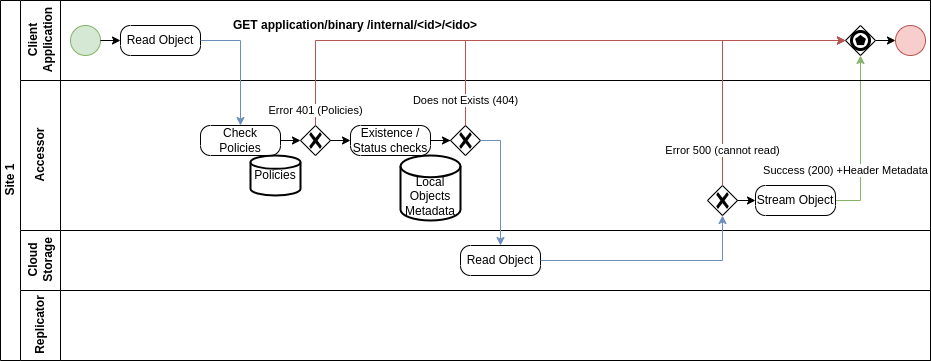

  Get Local Object's Content

