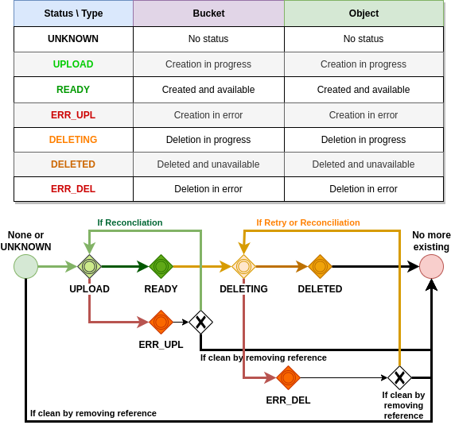

BPMN for Accessor
####################################

Short description of Dtos
******************************

.. code-block:: java
  :caption: Bucket Dto

  public class AccessorBucket {
    /**
     * Bucket name
     */
    private String id;
    /**
     * Site for this Bucket
     */
    private String site;
    /**
     * Creation or Deletion datetime
     */
    private Instant creation;
    /**
     * Optional expiry datetime
     */
    private Instant expires;
    /**
     * Status of this Bucket
     */
    private AccessorStatus status = AccessorStatus.UNKNOWN;

.. code-block:: java
  :caption: Object Dto

  public class AccessorObject {
    /**
     * Internal Id
     */
    private String id;
    /**
     * Site for this Object
     */
    private String site;
    /**
     * Bucket name
     */
    private String bucket;
    /**
     * Object name
     */
    private String name;
    /**
     * Optional: SHA 256 hash
     */
    private String hash;
    /**
     * Status of this Object
     */
    private AccessorStatus status = AccessorStatus.UNKNOWN;
    /**
     * Creation or Modification datetime
     */
    private Instant creation;
    /**
     * Optional expiry datetime
     */
    private Instant expires;
    /**
     * Length of the content of this Object
     */
    private long size;
    /**
     * Metadata if any for this Object
     */
    private final Map<String, String> metadata = new HashMap<>();

*Note: Metadata keys must be lower case, starting with a letter [a-z], following by any letter [a-z], number [0-9] and "_".*
This is a limitation coming from Cloud storages. Values can be string containing anything but **limited in size globally (< 2KB)**.

.. code-block:: java
  :caption: Filter Dto

  public class AccessorFilter {
    /**
     * Optional Prefix for the name, including path
     */
    private String namePrefix;
    /**
     * Optional list of status to filter on
     */
    private AccessorStatus[] statuses;
    /**
     * Optional datetime for creation before this date
     */
    private Instant creationBefore;
    /**
     * Optional datetime for creation after this date
     */
    private Instant creationAfter;
    /**
     * Optional datetime for expiry before this date
     */
    private Instant expiresBefore;
    /**
     * Optional datetime for expiry after this date
     */
    private Instant expiresAfter;
    /**
     * Optional length filter less than this length
     */
    private long sizeLessThan;
    /**
     * Optional length filter greater than this length
     */
    private long sizeGreaterThan;
    /**
     * Optional metadata filter based on equality
     */
    private final Map<String, String> metadataFilter = new HashMap<>();

Status logic
*************

  Status for Objects and Buckets

Bucket
**********

.. figure:: ../images/clone-cloud-store-diagram-Accessor-Bucket-Create.drawio.png
  :alt: Create Bucket

  Create Bucket

.. figure:: ../images/clone-cloud-store-diagram-Accessor-Bucket-MD-Simple.drawio.png
  :alt: Check Local Existence Bucket (GET for Metadata)

  Check Local Existence Bucket (GET for Metadata)

.. figure:: ../images/clone-cloud-store-diagram-Accessor-Bucket-MD.drawio.png
  :alt: Check Local/Remote Existence Bucket (GET for Metadata)

  Check Local/Remote Existence Bucket (GET for Metadata)

.. figure:: ../images/clone-cloud-store-diagram-Accessor-Bucket-Delete.drawio.png
  :alt: Delete Bucket

  Delete Bucket

  List Buckets

Object
**********

.. figure:: ../images/clone-cloud-store-diagram-Accessor-Create-Object.drawio.png
  :alt: Create Object

  Create Object

.. figure:: ../images/clone-cloud-store-diagram-Accessor-Read-MD-Simple.drawio.png
  :alt: Check Local Existence Object or GET Metadata

  Check Local Existence Object or GET Metadata

.. figure:: ../images/clone-cloud-store-diagram-Accessor-Read-MD.drawio.png
  :alt: Check Local/Remote Existence Object or GET Metadata

  Check Local/Remote Existence Object or GET Metadata

.. figure:: ../images/clone-cloud-store-diagram-Accessor-Read-Simple.drawio.png
  :alt: Get Local Object's Content

  Get Local Object's Content

.. figure:: ../images/clone-cloud-store-diagram-Accessor-Read.drawio.png
  :alt: Get Local/Remote Object's Content

  Get Local/Remote Object's Content

.. figure:: ../images/clone-cloud-store-diagram-Accessor-Delete.drawio.png
  :alt: Delete Object

  Delete Object

.. figure:: ../images/clone-cloud-store-diagram-Accessor-Bucket-List-Objects.drawio.png
  :alt: List Objects in Bucket

  List Objects in Bucket

Object with special Buffered option
************************************

.. figure:: ../images/clone-cloud-store-diagram-Accessor-Create-Object-Buffered.drawio.png
  :alt: Create Object with Buffered Option

  Create Object with Buffered Option

.. figure:: ../images/clone-cloud-store-diagram-Accessor-Read-Buffered.drawio.png
  :alt: Get Local/Remote Object's Content with Buffered option

  Get Local/Remote Object's Content with Buffered option (Accessor Public and Internal)

Bucket Internal
*****************
Specific implementations for Internal Accessor:

.. figure:: ../images/clone-cloud-store-diagram-Accessor-Bucket-MD-Internal.drawio.png
  :alt: Check Existence and Get Metadata for Local Bucket

  Check Existence and Get Metadata for Local Bucket

Object Internal
*******************
Specific implementations for Internal Accessor:

  Get Local Object's Content

