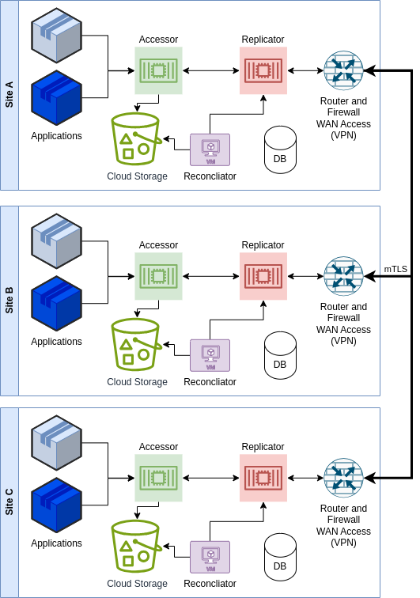
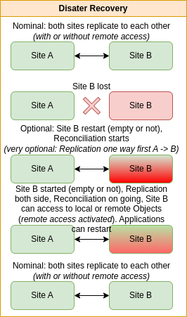
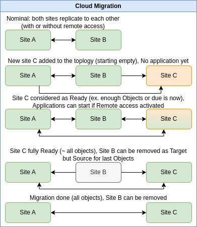

Description
####################################

This project uses Quarkus, the Supersonic Subatomic Java Framework and is compiled with Java 21.

If you want to learn more about Quarkus, please visit its website: https://quarkus.io/ .

**Clone Cloud Store** (*CCS*) allows to simplify access to Cloud Storage for major services such as
Amazon S3 or S3 like implementations, Azure Blob Storage and Google Cloud Storage.

It provides a simple REST API, much more simpler than usual ones, for Quarkus environments.

One of the goal is to simplify handling big InputStream files, without having to store them physically on disk
or in memory, neither in client application neither in front CCS services.

To allow this, specific functionalities of Quarkus Rest services (client and server) are used, such as the possibility
to send or receive such InputStream, chunk by chunk, and with back pressure control.

  *It might be possible to use other Http Client, but one has to take care of possible limitations of such Http SDK,
  such as to not send or receive from client side with all InputStream in memory.*

Clone Cloud Store allows also to clone storage between various Cloud sites, even using different
technologies (for instance, one using Amazon S3, another one using Azure Blob Storage):

- It can be used in 1 site only, or multiples sites (no limitations). When a bucket or object is created/deleted on
  one site, it is automatically asynchronously replicated to other sites. If an object is missing, due to outage or
  local issues, it can try to reach a copy synchronously on one of the remote sites and proceeds if it exists
  to its local restoration asynchronously.

- It provides a Reconciliation algorithm which will compare all sites to restore existing Bucket and Objects
  everywhere. This process is not blocking, meaning the sites can continue to run as usual.

- This reconciliation process allows Disaster Recovery process, without interruption of service during recovery. Note
  that new creation/deletion of Buckets or Objects is taken into account during reconciliation.

- This reconciliation process allows Cloud migration, without interruption of service during cloning. Note
  that new creation/deletion of Buckets or Objects is taken into account during reconciliation.

Cloud Clone Store relies on Quarkus and other technologies:

- A database to store the status of Buckets and Objects: MongoDB or PostgreSql
- A topic/queue system to allow asynchronous actions: Kafka or Pulsar
- Optional Prometheus to get observability metrics
- At least 5 JVM processes: (more JVM can be setup to improve reliability and performance)
  - Accessor (1 or more)
  - Accessor for Replicator (1 or more)
  - Replicator (1 or more)
  - Reconciliator (1)
  - Administration (1)

A simplest implementation with 1 JVM (1 or more) is available without database, topic or remote sites support.
It allows to test the solution with your application or to allow a smooth move to Cloud Clone Store:
**Accessor Simple Gateway**

Notes of versions
**********************

0.8.0 2024/02
==============

- Add Apache http client for Accessor Public client (no Quarkus dependency)

0.7.0 2024/01
==============

- Support of Simple Gateway Accessor
- First steps on Reconciliator batch

0.6.0 2023/11
==============

- Patch of Quarkus to support InputStream on client side (upload and download)

0.5.0 2023/10
==============

- Refactorization and simplification
- Support of Dynamic choice of Database (MongoDB or PostgreSql) in Common

0.4.0 2023/09
==============

- Performance improvements
- Support of Proactive replication from Accessor

0.3.0 2023/07
==============

- Adding Topology support to Replicator
- Support of Public Accessor with remote access

0.2.0 2023/01
==============

- Replicator support with asynchronous replication
- Internal Accessor support
- Support of Kafka

0.1.0 2022/06
==============

- Public Accessor support
- Driver for Amazon S3 and S3 like support
- Support of MongoDB

Status logic
*************

.. figure:: ../images/clone-cloud-store-diagram-Status.drawio.png
  :alt: Status for Objects and Buckets

  Status for Objects and Buckets

Architecture
*******************

  Architecture on 1 site

  Architecture on multiple sites

Disaster Recovery or Cloud Migration
*****************************************

  Disaster Recovery

  Cloud Migration
